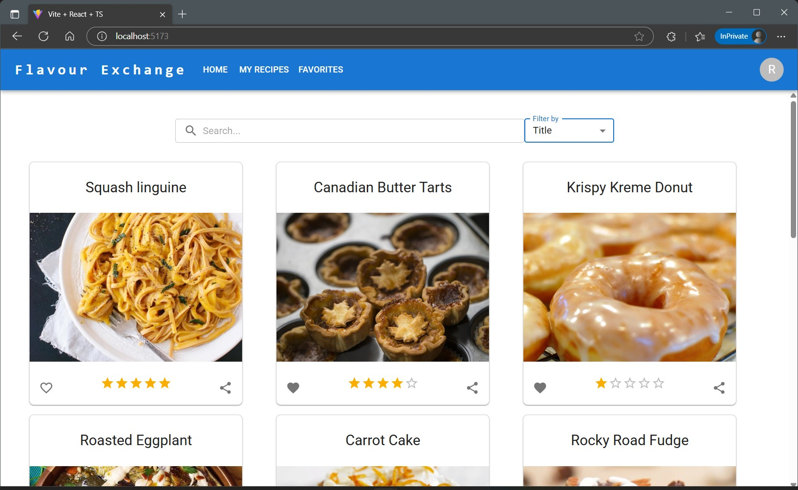
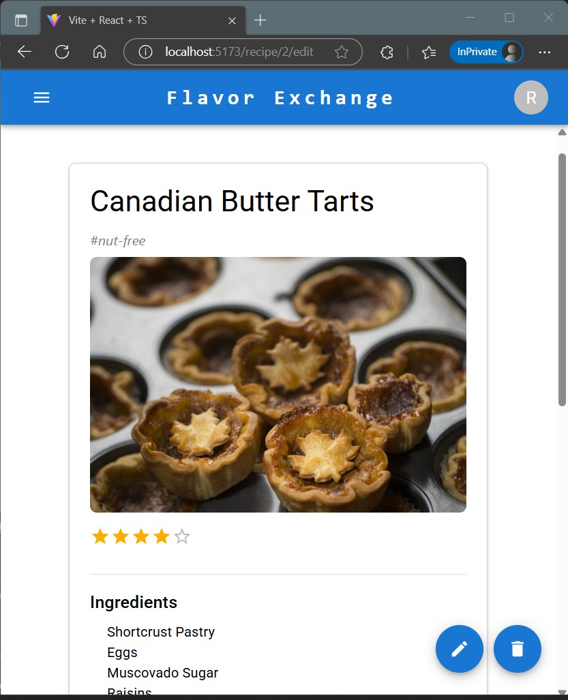

# 🍲 Flavor Exchange

**Flavor Exchange** is a modern React-based mock recipe management app where users can register, log in, browse, search, create, edit, and delete recipes. Users can also favorite recipes they love — all powered by a **mock API** and **client-side authentication** using Local Storage.

---

## ✨ Core Features

1. **🔐 User Authentication**

   - Register and log in with client-side validation
   - User data is stored securely in **Local Storage**

2. **📋 Recipe Management (CRUD)**

   - View, add, edit, and delete recipes
   - Search by recipe name or ingredients

3. **⭐ Favorites System**

   - Mark and unmark recipes as favorites
   - Favorites are persisted in Local Storage

4. **🧪 Mock API Integration**

   - Recipe data is loaded from a static JSON file (`api/data/recipes.json`)
   - API layer simulates async requests with promise delays

5. **🎯 Advanced Filtering**

   - Filter recipes based on dietary restrictions (e.g., **vegan**, **gluten-free**)
   - Supports multiple filters for better user experience

6. **⚠️ Error Handling**
   - Uses **React Error Boundary** for graceful error fallback UI

---

## 🧱 Tech Stack

- ⚛️ **React 19** + **TypeScript**
- 🎨 **Material UI (MUI)** for prebuilt UI components
- 🧵 **Tailwind CSS** for custom utility-first styling
- 🧠 **Zustand** for global state management
- 🧩 **React Router v7** for navigation
- 🚀 **Vite** for blazing-fast development
- ✅ **ESLint** & **TypeScript** for code quality and linting
- ❌ **React Error Boundary** for error fallback UI

---

## 🚀 Getting Started

### 1. Clone the repository

```bash
git clone https://github.com/your-username/flavor-exchange.git
cd flavor-exchange

```

## 2. Install dependencies

```bash
npm install
```

## 3. Run the development server

```bash
npm run dev
```

## 4. login

- Create a test user via the registration form

- Log in using the credentials you just created

- All user data and favorites are saved in Local Storage

## 🗃️ Project Structure Highlights

```bash
src/
├── api/                   # Mock API layer
│   ├── data/              # Static JSON dataset
│   └── dto/               # Data Transport layer
│   └── models/            # Data types
│   └── service/           # API simulation logic
├── hooks/                 # Custom hooks (e.g., useForm)
├── store/                 # Zustand state management
├── routes/                # Main route-based pages
├── components/            # Reusable UI components
└── App.tsx                # Main app layout & routing
```

## Demo Screenshots

|              Home Screen              |                 Recipe Details Screen                 |
| :-----------------------------------: | :---------------------------------------------------: |
|  |  |

## 📌 Notes

- All recipes and user info are managed client-side only.

- There is no real backend — perfect for frontend testing or prototyping.

- You can easily switch to a real backend like Firebase or REST APIs in future versions.

## 🙌 Acknowledgments

[React](https://reactjs.org/)

[Material UI](https://mui.com/)

[Tailwind CSS](https://tailwindcss.com/)

[Zustand](https://github.com/pmndrs/zustand)

[Vite](https://vitejs.dev/)

## 👤 Author

**Ridmi Weerasinghe** -
An aspiring full-stack developer passionate about building clean and functional web apps.
